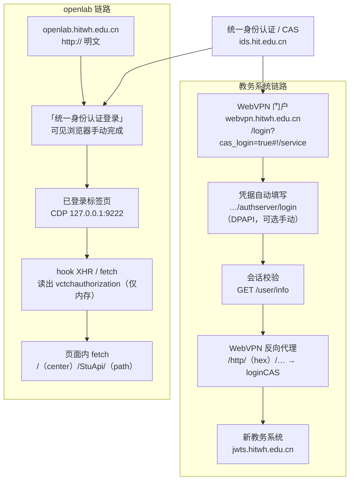

# 认证框架

一句话结论：**本项目里有两个彼此独立的认证链——教务系统走 WebVPN 反向代理，openlab 实验系统走应用自带的 `vctchauthorization` 请求头；它们共享同一个统一身份认证（CAS）凭据，但不共享会话。而“校园网 / 校外 VPN”这个变量，只对 openlab 有意义，对教务系统的代码路径没有影响。**

---

## 1. 总览

```
                          统一身份认证 / CAS  (ids.hit.edu.cn)
                                      │
                  ┌───────────────────┴───────────────────┐
                  │                                       │
          【教务系统链路】                            【openlab 链路】
    webvpn.hitwh.edu.cn 门户                     openlab.hitwh.edu.cn
    ├ CAS 入口 /login?cas_login=true#!/service   ├ 「统一身份认证登录」按钮
    ├ 凭据自动填写 …/authserver/login            ├ 用户在可见浏览器里手动完成
    └ 会话校验 GET /user/info                    └ 会话存 storage_state.json
                  │                                       │
       WebVPN 反向代理 /http/<hex>/…              应用自定义请求头
       （编码指向 jwts.hitwh.edu.cn）              vctchauthorization
                  │                                       │
        新教务系统 jwts.hitwh.edu.cn             /<center>/StuApi/<path>
```

两条链路互不依赖：WebVPN 会话失效不会影响已登录的 openlab 标签页，反之亦然。



---

### 1.1 正常初始化（从零到可用，一次走完）

**openlab 链路**（①–④ 未直接抓到，按平台结构推断；⑤–⑨ 已实测）

```text
① 打开 http://openlab.hitwh.edu.cn/            → 鉴权中心（#/index）
② 未登录 → 跳统一身份认证 ids.hit.edu.cn/authserver/login?service=…
   人工完成（可能含验证码或扫码）
③ CAS 带 ticket 回跳 openlab
④ 网关校验 ticket → 种下 Cookie
   vcToken     域 openlab.hitwh.edu.cn   寿命 ≈ 1 天
   JSESSIONID  路径 /lmsAuthApi          会话级
⑤ 鉴权中心点「点击进入」
⑥ POST /lmsAuthApi/apps/goto/{中心} → {typ, uri, token}    一次性证书
⑦ POST /{中心}/StuApi/auth/cas/login  body: vcToken=<⑥返回的 token>
   → 应用令牌 {token, uid, uname, utyp}
⑧ 应用把令牌加密写入 localStorage（解密密钥在 sessionStorage，按标签页）
⑨ 之后每个 StuApi 请求带 vctchauthorization: <应用令牌>
```

第 ⑦ 步的 `vcToken` **必须用 ⑥ 返回的 token**：直接拿 Cookie 里的同名值去换会得到 `5000 登录证书失效`（实测）。

第 ⑨ 步之后浏览器可以完全不参与：纯 HTTP POST + 该请求头、**不带任何 Cookie** 即可 `code=0`（实测）。

**教务链路**（已实测）

```text
① 打开 webvpn.hitwh.edu.cn → 统一身份认证登录
② 得到 WebVPN 会话（ticket Cookie，≈ 6.7 天）
③ 走反向代理 /http/<hex>/… 访问 jwts；<hex> 按目标主机编码
④ jwts 自身会话 Cookie（会话级）
```

**本工具所需的「初始化」只有一件事**：人工登录一次，并把某个中心的应用页停在一个标签页上；工具通过 CDP 读一次应用令牌（仅内存），之后全部走纯 HTTP。由于网关 Cookie 与应用令牌都在「约一天」的量级，通常每天需要重来一次。

---

## 2. 四变量矩阵

两个取值维度相乘得到四种组合：

| 网络位置 ↓ ／ 目标系统 → | 教务系统（`jwts.hitwh.edu.cn`） | openlab 开放式实验系统 |
| --- | --- | --- |
| **校园网内网直连** | 代码中**没有**直连路径，仍然走 WebVPN 反向代理 | 设计上的主路径：明文 HTTP + `vctchauthorization`，无需 Cookie |
| **校外 ／ 已连 VPN** | 主路径，也是唯一路径：WebVPN 反向代理 + CAS 会话 | 代码中**没有** WebVPN 代理 openlab 的路径，只能借用户自己已可达的已登录标签页 |

### 2.1 校园网 + 教务系统

即使身处校园网，`PlaywrightAcademicGateway` 依然把请求发到 `webvpn.hitwh.edu.cn` 的代理路径：

```
https://webvpn.hitwh.edu.cn/http/77726476706e69737468656265737421fae0558f693861446900c7a99c406d3667/kbcx/queryGrkb
```

路径中的十六进制前缀 `77726476706e69737468656265737421` 即 `wrdvpnisthebest!`，其后是 WebVPN 对目标主机 `jwts.hitwh.edu.cn` 的编码。代码中不存在绕过 WebVPN 直连教务系统的分支。

### 2.2 校园网 + openlab

`HttpLabTransport` 明确面向这条路径：纯 HTTP POST，只带 `vctchauthorization` 头，**不需要 Cookie，也不需要浏览器**（模块文档注明这是校园网所允许的方式）。

但要注意两点：

- **token 的获取仍需一次浏览器**。`vctchauthorization` 由页面自身发起的请求产生，`acquire_token()` 通过 CDP 连到用户已登录的标签页，hook `XMLHttpRequest.setRequestHeader` 与 `window.fetch` 才能读到它。
- **换令牌不能用 Cookie 的值**。`cas/login` 的 `vcToken` 参数来自 `goto/{中心}` 的响应，不是 Cookie 里的同名值；用 Cookie 值会得到 `5000 登录证书失效`（实测）。
- **CLI 目前没有接入这条路径**。`http_lab_transport()` 工厂只在测试中被调用，`lab-booking` 命令始终使用 `BrowserLabSession.attach(cdp_url, center)`，也就是在页面内发 `fetch`。校园网直连 HTTP 属于「已实现且有测试覆盖，但尚未接线」。

### 2.3 校外 + openlab

代码中没有把 openlab 挂到 WebVPN 代理上的任何路径，openlab 主机在代码里始终写作 `http://openlab.hitwh.edu.cn`。

校外场景唯一被支持的形式是 `BrowserLabTransport`：在**用户自己已经打开、且已经可达的**标签页里，用页面自身的 `fetch`（`credentials: 'include'`）发请求。也就是说，可达性由用户自己解决（校园网、自建隧道或学校提供的其他方式），本工具不提供网络接入。

### 2.4 校外 + 教务系统

这是代码覆盖最完整的路径，也是工作台默认的使用场景：

1. 打开 `https://webvpn.hitwh.edu.cn/login?cas_login=true#!/service`；
2. 若存在 DPAPI 保存的凭据，在 `webvpn.hitwh.edu.cn` 的 `authserver/login` 上自动填写并提交，否则等待用户手动登录；
3. 用 `GET /user/info`、`/user/portal_groups` 验证 WebVPN 会话；
4. 打开「新教务系统」资源，落到代理路径根，再经 `…/loginCAS` 建立教务会话；
5. 以固定的受保护只读页（`kbcx/queryGrkb`）确认会话真正可用，而不是把 `loginCAS` 中转页当作成功。

---

## 3. 网络切换的影响：IP 绑定

WebVPN 会话与客户端 IP 绑定。换网络（例如从校园网切到校外、或切换 VPN 出口）会让服务端把会话踢到 `/login?logoutByIpChange=true`。

代码把这个踢出当作**一次性自愈检查**处理：先用 `GET /user/info` 探测，如果请求层已经重新接受该会话，就在同一个标签页里恢复原 URL，不当作真正的登出，也不清空凭据。因此换网络后不需要重新 `configure-login`，但可能出现一次短暂的中断。

---

## 4. 会话寿命与失败分类

| 会话 | 载具 | 观测寿命 |
| --- | --- | --- |
| CAS 会话 | 浏览器 Cookie（`ids.hit.edu.cn`） | 会话级（关浏览器即失） |
| WebVPN 会话 | 浏览器 Cookie（`.webvpn.hitwh.edu.cn`） | ≈ 160 小时 |
| openlab 网关 | Cookie `vcToken` + `JSESSIONID` | `vcToken` ≈ 19 小时；`JSESSIONID` 会话级 |
| openlab 应用令牌 | 浏览器 localStorage（加密）+ sessionStorage 密钥 | 未知，实测会过期 |

已观测的业务码决定失败应该交给谁处理：

| 码 | 含义 | 处理方 |
| --- | --- | --- |
| `0` | 请求成功 | — |
| `1002` | Token 不合法（应用令牌过期） | 重新进入一次中心应用 |
| `1003` | 权限错误（未带 `vctchauthorization`） | 工具自身的调用错误 |
| `5000` | 业务失败，文案随场景：`没有可供选择的座位` / `您已经预约过此实验项目` / `此座位已被预约，请选择其它座位`；网关侧另有 `当前用户未授权`、`应用已关闭，请联系管理员` | 学校侧状态或座位竞争，由人工决定 |

**HTTP 200 不等于成功**：业务结果在信封 `{code, message, result, timestamp}` 里，规划与提交流程都按这个约定判成败。

---

## 5. 凭据与落盘位置

| 内容 | 位置 | 说明 |
| --- | --- | --- |
| 统一身份认证账号密码 | `.private/course-progress/webvpn-login.dpapi` | Windows DPAPI 加密，仅当前 Windows 用户可解密 |
| 教务 / WebVPN 会话状态 | `.private/course-progress/webvpn-auth-state.json` | 含认证 Cookie，Git 已忽略 |
| 教务浏览器 profile | `.private/course-progress/playwright-chromium-profile/` | Playwright 持久化 profile |
| openlab 应用 token | 仅内存 | 进程结束后消失，从不落盘 |
| openlab 网关 Cookie（`vcToken` / `JSESSIONID`） | 浏览器 | 本工具既不读取也不落盘；换令牌走 ⑥ 的响应，不依赖 Cookie |
| 契约基线 | `docs/contracts/`（入仓） | 只含端点、字段名与业务码，不含个人数据 |
| 契约观测 | `.private/`（Git 忽略） | 单机证据，可随时重建 |

`vctchauthorization` 是凭据，因此它在 `lab_transport.py` 中被明确标注为「kept in memory for the life of the process and never written to disk」。

---

## 6. 待核实与已知风险

- **openlab 使用明文 HTTP。** 代码中的 openlab 主机是 `http://openlab.hitwh.edu.cn`，`BrowserLabTransport` 也是相对当前页面发 `fetch`。若该站点未强制跳转 HTTPS，`vctchauthorization` 请求头会在校园网内以明文传输。本仓库尚未在真实环境核实其是否强制 HTTPS，也未做校验或警告。
- **校园网直连 openlab 的 HTTP 传输尚未接线**（见 2.2），当前所有 `lab-booking` 调用都依赖一个已打开的浏览器标签页。
- **两条链路的真实环境兼容性都未完成验收。** 教务链路的读取与提交流程、openlab 的预约流程均未通过完整真实环境验收；上述路径来自代码与既有页面观察，不代表学校当前实现未变化。

---

## 7. 代码位置索引

| 事实 | 位置 |
| --- | --- |
| WebVPN 门户入口 | `course_progress/explorer.py`（`DEFAULT_PORTAL_URL`） |
| CAS 入口、`/user/info`、凭据页判定、IP 踢出自愈 | `course_progress/session.py` |
| DPAPI 凭据存储 | `course_progress/credentials.py` |
| 教务代理路径、`loginCAS`、健康检查 URL | `course_selection/gateway.py` |
| 已核验的选课查询页 URL | `course_selection/selection_query.py` |
| openlab 主机与 token 头 | `course_selection/lab_transport.py` |
| 契约快照、指纹与漂移分级 | `course_selection/lab_contract.py` |
| 两种 openlab 传输后端 | `course_selection/lab_transport.py`（`HttpLabTransport` / `BrowserLabTransport`） |
| token hook 与借用标签页 | `course_selection/lab_transport.py`（`TOKEN_HOOK` / `acquire_token`）、`course_selection/lab_booking.py`（`BrowserLabSession.attach`） |
